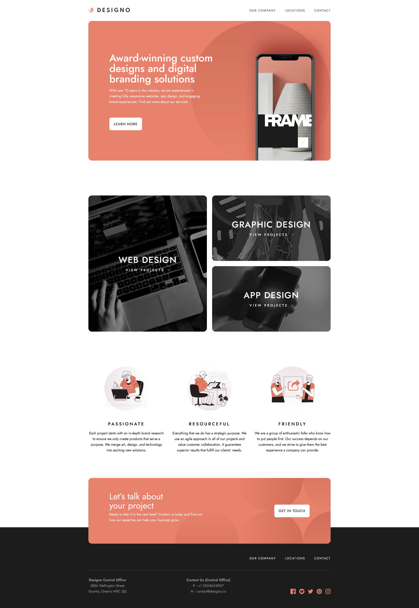

## Table of contents

- [Overview](#overview)
  - [Screenshot](#screenshot)
  - [Links](#links)
- [My process](#my-process)
  - [Built with](#built-with)
- [Author](#author)

## Overview

### Screenshot

### Links

- Solution URL: [github.com/JuaniSilva/designo-landing](https://github.com/JuaniSilva/designo-landing)
- Live Site URL: [designo-landing-theta.vercel.app](https://designo-landing-theta.vercel.app/)

## My process

### Built with

- Semantic HTML5 markup
- Tailwind
- Flexbox and Grid
- Mobile-first workflow
- [Next.js](https://nextjs.org/) - React framework
- [Framer Motion](https://www.framer.com/motion/) - Animation Library

## Author

- Website - [Juani Silva](https://github.com/JuaniSilva)
- Frontend Mentor - [@JuaniSilva](https://www.frontendmentor.io/profile/JuaniSilva)
- Twitter - [@Juani_Silva13](https://twitter.com/Juani_Silva13)
